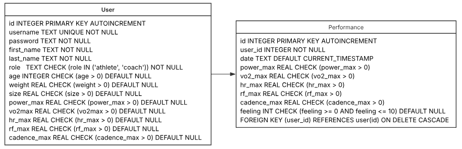

# Simplon_CycleTrack-API

## Présentation du projet

**Simplon_CycleTrack-API** est une solution destinée à l'enregistrement et à l'analyse des performances des athlètes d'une équipe professionnelle de cyclisme. L'objectif est de stocker les données des tests effectués par les cyclistes dans une base de données et de les rendre accessibles via une API RESTful.

L'API est développée avec **FastAPI** et utilise **SQLite** comme base de données. Elle permet aux utilisateurs (athlètes et coachs) d'enregistrer et de consulter les performances sportives afin d'analyser et d'optimiser l'entraînement.

## Schémas de la base de données

### Modèle Conceptuel des Données (MCD)

### Modèle Physique des Données (MPD)

---
**Technologies utilisées :**
- Python
- FastAPI
- SQLite
- JWT pour l'authentification

Ce README sera enrichi au fur et à mesure de l'avancement du projet.

