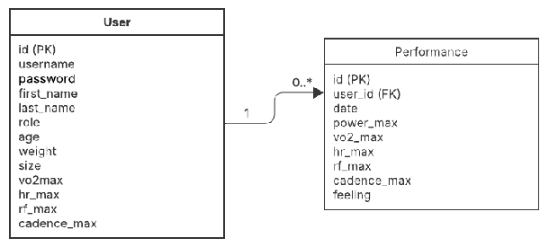

# Simplon_CycleTrack-API

## Présentation du projet

**Simplon_CycleTrack-API** est une solution destinée à l'enregistrement et à l'analyse des performances des athlètes d'une équipe professionnelle de cyclisme. L'objectif est de stocker les données des tests effectués par les cyclistes dans une base de données et de les rendre accessibles via une API RESTful.

L'API est développée avec **FastAPI** et utilise **SQLite** comme base de données. Elle permet aux utilisateurs (athlètes et coachs) d'enregistrer et de consulter les performances sportives afin d'analyser et d'optimiser l'entraînement.

> **Note importante** : Ce projet a été réalisé dans un cadre académique chez Simplon. Par contrainte pédagogique, nous n'avons pas utilisé d'ORM (Object-Relational Mapping) afin de nous entraîner à écrire des requêtes SQL natives et de mieux comprendre les interactions avec la base de données.

## Schémas de la base de données

### Modèle Conceptuel des Données (MCD)


### Modèle Physique des Données (MPD)


## Fonctionnalités principales

- **Gestion des utilisateurs** : Inscription, connexion, modification et suppression de profils
- **Gestion des rôles** : Distinction entre athlètes et coachs avec droits d'accès différenciés
- **Enregistrement des performances** : Stockage des métriques clés (puissance, VO2 max, fréquence cardiaque, etc.)
- **Analyse de données** : Visualisation et comparaison des performances dans le temps
- **API RESTful** : Endpoints documentés pour toutes les opérations CRUD

## Installation et démarrage

### Prérequis
- Python 3.8 ou supérieur

### Installation

1. Cloner le dépôt :
```bash
git clone https://github.com/Khadaassi/Simplon_CycleTrack-API.git
cd Simplon_CycleTrack-API
```

2. Créer et activer un environnement virtuel :
```bash
python -m venv venv
source venv/bin/activate  # Sur Windows : venv\Scripts\activate
```

3. Installer les dépendances :
```bash
pip install -r requirements.txt
```

4. Initialiser la base de données :
```bash
python init_db.py
```

5. Lancer l'application :
```bash
uvicorn main:app --reload
```

L'API est maintenant accessible à l'adresse `http://localhost:8000`.

## Documentation de l'API

Une fois l'application lancée, la documentation interactive de l'API est disponible à l'adresse :
- Swagger UI : `http://localhost:8000/docs`
- ReDoc : `http://localhost:8000/redoc`

## Structure du projet

```
Simplon_CycleTrack-API/
├── main.py                 # Point d'entrée de l'application
├── core/                   # Configuration principale
│   ├── config.py           # Variables d'environnement
│   └── security.py         # Authentification JWT
├── db/                     # Gestion de la base de données
│   ├── database.py         # Connexion à la base de données
│   └── CRUD/               # Opérations Create, Read, Update, Delete
│       ├── user.py         # Opérations sur les utilisateurs
│       └── performance.py  # Opérations sur les performances
├── routers/                # Définition des routes API
│   ├── auth.py             # Routes d'authentification
│   ├── users.py            # Routes pour les utilisateurs
│   └── performance.py      # Routes pour les performances
├── schemas/                # Modèles de données Pydantic
│   ├── user.py             # Modèles pour les utilisateurs
│   └── performance.py      # Modèles pour les performances
└── data_int/               # Données d'initialisation
```

## Technologies utilisées

- **Python** : Langage de programmation principal
- **FastAPI** : Framework web rapide pour la création d'APIs
- **SQLite** : Base de données légère et sans serveur
- **JWT** : JSON Web Tokens pour l'authentification
- **Pandas** : Manipulation et analyse des données
- **Pydantic** : Validation des données et sérialisation

